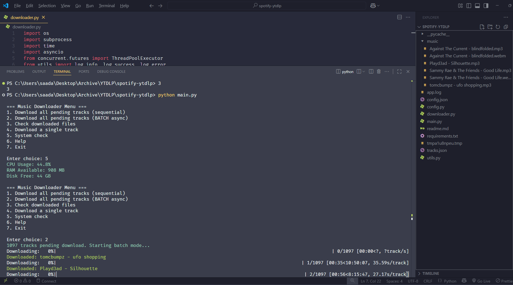
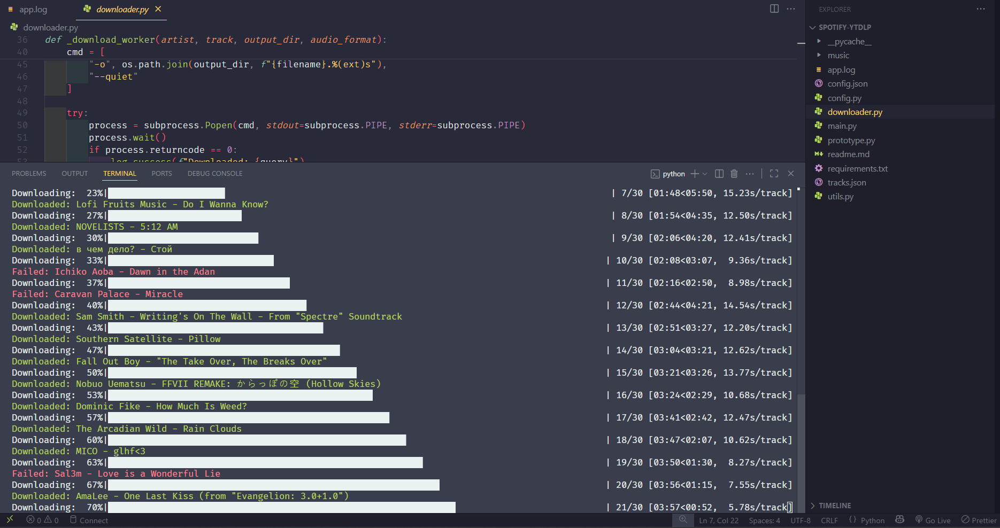

# 🎶 Potty

A modular, Python-based command-line tool for downloading music from Spotify & Youtube using **yt-dlp**.  
Features interactive menus, system checks, download management, metadata embedding, and robust logging.

---

## Screenshots




---

## 📌 Features

- **Enhanced Interactive CLI menus** for downloads, management, and automation
- **Configurable settings** in `config.json`
- **Track management** via JSON files (pending, failed, history)
- **System resource checks** (CPU, RAM, storage)
- **Download by artist and song name**
- **Batch and single downloads**
- **metadata embedding** for downloaded music 
- **Retry failed downloads**
- **Duplicate detection and file organization**
- **Colorful terminal logs** (via `colorama`)
- **Persistent logging** to `app.log`
- **Modular, maintainable codebase**
- **Playlist file download**: using the playlist file.
- **Flexible playlist downloads**: whole playlists at once or individual ones.
- **Export library data** as JSON with detailed track and album info.
- **Clean up music library** by removing broken, or unreadable tracks.
- **Choosing audio format** and target bitrate w/ quality and size impacts.
- **Download From Youtube** paste the link and download playlist or video as audio file.


---

## 🛠 Prerequisite for spotify downloads: **Export Your Spotify Data**

Before using Potty, you need to request your personal Spotify data from Spotify’s Privacy page. Spotify will provide you with a ZIP file containing several JSON files, including one named YourLibrary.json.

This YourLibrary.json file contains your saved tracks, albums, and playlists metadata, which Potty can use to generate the track list and manage downloads.

How to get your Spotify data:

    Go to Spotify’s Privacy Request page.

    Request your personal data export.

    Spotify will email you a ZIP file when ready.

    Extract the ZIP and locate YourLibrary.json.

    Use or convert this JSON file as the basis for your data/tracks.json to run Potty.

This step is essential to generate the input data Potty needs for downloading your favorite music.

---

## 📂 Project Structure

```
spotify-ytdlp/
│
├── main.py                # Entry point, interactive menus
├── config.py              # Loads config from config.json
├── config.json            # User-configurable settings
├── requirements.txt       # Dependencies
├── changelog.md           # change log
├── app.log                # Log file
├── todo.md                # Development notes
├── constants.py           # constants
│
├── history/
│   └── prototype.py       # First version of this entire app 
│
├── data/
│   ├── tracks.json            # Track list (with artist, album, track, uri)
│   ├── failed_downloads.json  # Tracks that failed to download
│   └── download_history.json  # Downloaded tracks history
│
├── export/
│   ├── potyy_export_(MDY).json  # export of tracks in music folder
│   └── playlist_tracklist.json  # playlist in tracks format
│
├── downloader/
│   ├── base_downloader.py                # Download logic (single, batch)
│   ├── playlist_download.py              # Download playlists
│   ├── metadata.py                       # Embed metadata
│   ├── retry_manager.py                  # Retry failed downloads
│   ├── youtube_link_downloader.py        # Download Directly from youtube link
│   └── __init__.py│
│
├── menus/                     # Interactive menu modules
│   ├── automation_menu.py     # Menu for automation section
│   ├── downloads_menu.py      # Menu for downloads section
│   ├── main_menu.py           # Menu for main section
│   ├── management_menu.py     # Menu for management section
│   ├── tools_menu.py          # Menu for tools section
│   └── __init__.py
│
├── tools/
│   ├── choose_audio_format.py      # pick global format for download
│   ├── compress_music.py           # compress songs to a certain format
│   ├── dependency_check.py         # check if your dependencies are installed
│   ├── library_cleanup.py          # deletes broken track files
│   ├── library_export_json.py      # all tracks in music folder as json
│   ├── open_log.py                 # opens app.log
│   ├── playlist_to_tracklist.py    # playlist turned into tracklist format
│   └── __init__.py
│
├── managers/
│   ├── file_manager.py        # Duplicate detection, file organization
│   ├── resume_manager.py      # Resume batch downloads
│   ├── schedule_manager.py    # Scheduled downloads
│   └── __init__.py
│
├── utils/
│   ├── logger.py              # Logging utilities
│   ├── loaders.py             # Loading utilities
│   ├── system.py              # System resource checks
│   ├── track_checker.py       # Check downloaded files
│   └── __init__.py
│
└── music/                 # Downloaded music files
```

---

## ⚙️ Installation

1. **Clone the repository**:

   ```bash
   git clone https://github.com/Ssenseii/spotify-yt-dlp-downloader.git
   cd spotify-ytdlp
   ```

2. **Install dependencies**:

   ```bash
   pip install -r requirements.txt
   ```

> (if you use system check it'll say yt-dlp is not installed even if it is so don't worry about that until I fix that check).

3. **Ensure `yt-dlp` is installed**:

   ```bash
   pip install yt-dlp
   ```


---

## 📄 Configuration

Edit `config.json` to set your preferences:

```json
{
	"tracks_file": "data/tracks.json",
	"playlists_file": "data/playlists.json",
	"output_dir": "music",
	"audio_format": "mp3",
	"sleep_between": 5,
	"average_download_time": 20
}
```

---

## 🎵 Track List Format

`data/tracks.json` should contain:

```json
{
	"tracks": [
		{
			"artist": "Artist Name",
			"album": "Album Name",
			"track": "Song Title",
			"uri": "spotify:track:xxxx"
		}
	]
}
```

---

## 🎵 Playlist Format

`data/playlists.json` should contain:

```json
{
  "playlists": [
    {
      "name": "Simon vol.94",
      "lastModifiedDate": "2025-05-03",
      "items": [
        {
          "track": {
            "trackName": "Time of Our Lives",
            "artistName": "Pitbull",
            "albumName": "Globalization",
            "trackUri": "spotify:track:2bJvI42r8EF3wxjOuDav4r"
          },
          "episode": null,
          "audiobook": null,
          "localTrack": null,
          "addedDate": "2025-05-03"
        },
      ],
   }]
}
```

---

## ▶️ Usage

Run the program:

```bash
python main.py
```

You will see a menu with options for downloading, checking files, importing playlists, retrying failed downloads, and more.

---

Here’s the updated Dependencies section including `mutagen` and `schedule`:

---

## 🛠 Dependencies

- [yt-dlp](https://github.com/yt-dlp/yt-dlp) - YouTube downloader
- [psutil](https://pypi.org/project/psutil/) - System resource monitoring
- [colorama](https://pypi.org/project/colorama/) - Colored terminal output
- [mutagen](https://pypi.org/project/mutagen/) - Audio metadata tagging and manipulation
- [schedule](https://pypi.org/project/schedule/) - Job scheduling for periodic tasks
- [Questionar](https://pypi.org/project/questionary/) - for the interactive menu 
- [Shutil](https://pypi.org/project/shutil/) - for systems stuff

Install all:

```bash
pip install -r requirements.txt
```

---

## 📜 Logging

- **Terminal output** is colored for readability
- **`app.log`** stores a full log history of actions, warnings, and errors

---

## ⚠️ Disclaimer

This tool is for **personal use only**.  
Ensure you respect copyright laws and YouTube’s terms.
